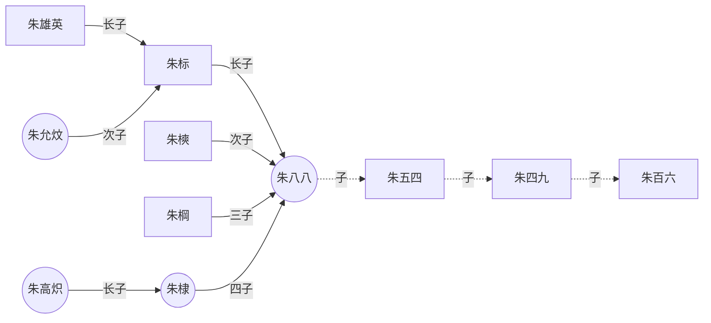

```sequence
A->B: 因果关
Note right of B: 思维导图
B-->A: 反向因果关系


```


```mermaid
graph LR
emperor((朱八八))-.子.->朱五四-.子.->朱四九-.子.->朱百六


朱雄英--长子-->朱标--长子-->emperor
emperor2((朱允炆))--次子-->朱标
朱樉--次子-->emperor
朱棡--三子-->emperor
emperor3((朱棣))--四子-->emperor
emperor4((朱高炽))--长子-->emperor3
```


